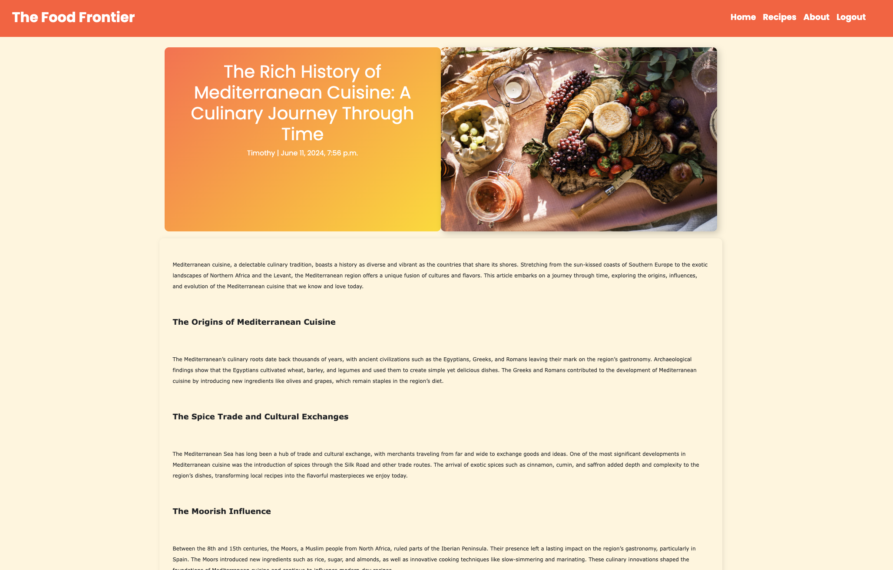
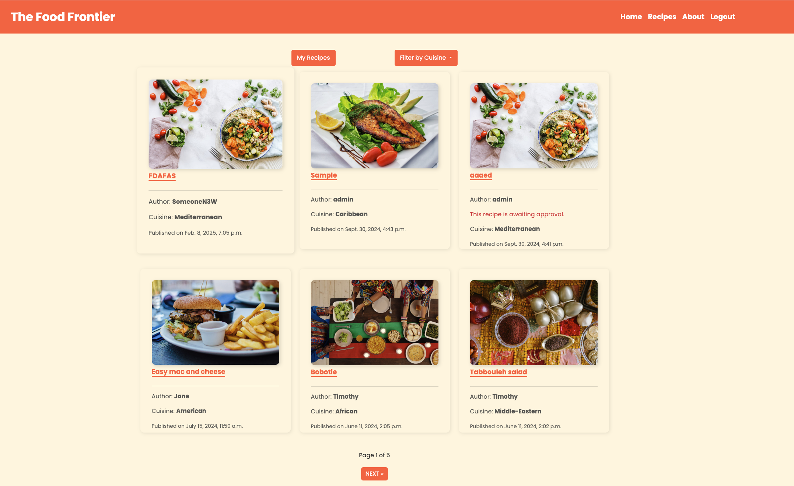
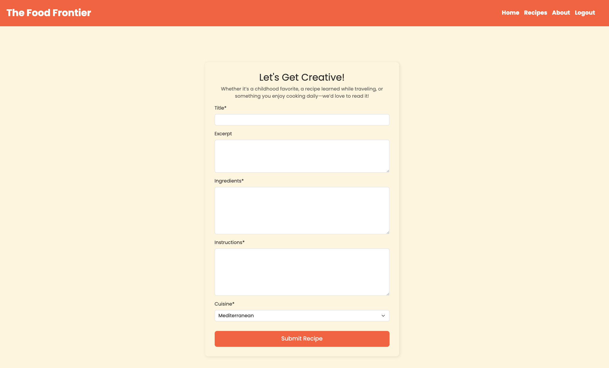
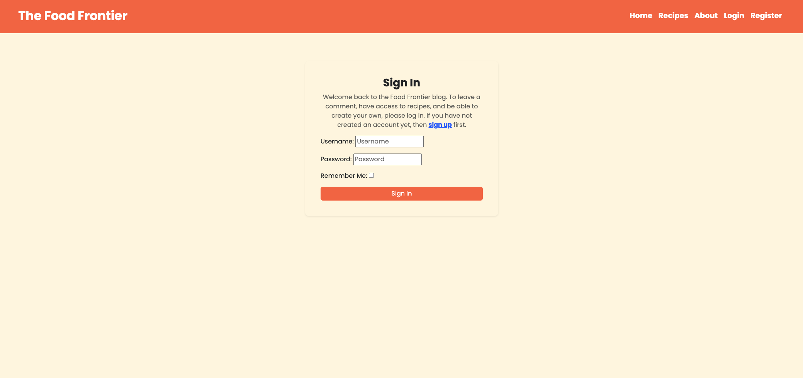
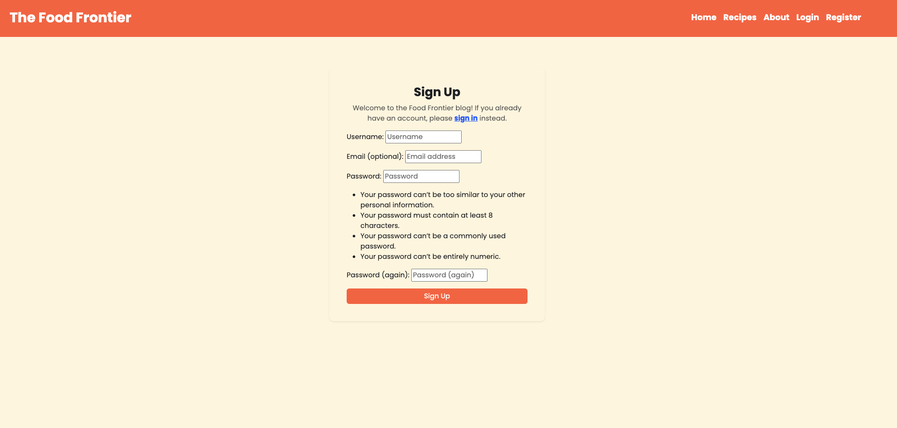

# The Food Frontier


The Food Frontier is a place for those enthusiastic and passionate about food. It consists of three major pages, the Home page which includes a variety of food based articles, an About page which describes the blogs purpose and a Recipes page which can be accessed by Registered users exclusively. It allows the user to interact with the blog and even contribute to it by adding their own recipes and comments to posts.

The deployed link of The Food Frontier can be found [here](https://the-food-frontier-ff520c1682a7.herokuapp.com/)

## Table of Contents
+ [UX](#ux "UX")
+ [User Stories](#user-stories "User Stories")
+ [Design](#design "Design")
+ [Features](#features "Features")
+ [Testing](#testing "Testing")
+ [Technologies Used](#technologies-used "Technologies Used")
+ [Deployment](#deployment "Deployment")
+ [Credits](#credits "Credits")

## UX

### Site Purpose:
The main pupropse of this blog is to provide food lovers a place where they can read about food but also experiment with it by trying the pre-existing recipes. In addition, it allows them to add their own recipes and share with others their favourite recipes, easy to cook recipes or even recipes that are ideal for the busy weekday evenings after work.

### Audience:
This website is aimed for anyone with a passion for food and regardless of age. Whether a home cook, work in a professional kitchen or just curious to find out new recipes and ways of cooking this food blog is ideal for you.

### Navigation:
Each page of the blog is displayed clearly through a navbar which offers the user the ability to navigate between pages with ease. Those include the Home, About, Register and Login for non logged-in users and Home, Recipes, About and Logout for logged-in users.

## User Stories

#### As an admin:
1. I can have access to the admin panel in order to create posts and recipes to populate the Home and Recipes page.
2. I can access posts pending for approval and approve or dissapprove them depending on the content.
3. I can access comments pending for approval and approve or dissapprove them.
4. I can access recipes pending for approval and approve or dissapprove them.
5. I can have full CRUD functionality to all posts, comments and recipes.

#### As a user:
1. I can create an account in order to have full access to the blog (Posts, Commenting, Recipes and Recipe Form).
2. I can open a post by clicking on it.
3. I can comment on a post and express my opinion.
4. I can modify or delete a comment created by me.
5. I can create a recipe by submitting the recipe form for approval.
6. I can access all recipes created by me, approved or not, to either modify or delete them(CRUD).
7. I can access the about page in order to find out more about the food blog.
8. I can access the recipes page which included recipes written by other users too.
9. I can access recipes written by me on the My Recipes tab.
10. I can filter recipes depending on which cuisine they're at by choosing a cuisine from the dropdown menu.

## Design 
### Wireframes:

#### Entity-Relationship Diagram:


#### Home Page:


#### Post Detail Page:


#### Recipes Page:


#### Recipes Detail Page:


#### Recipe Form:


#### About Page:


#### Login Page:


#### Register Page:


### Colour Palette:


### Typography:
Fonts were taken from Google Fonts and I've decided to use the following:
- 'Poppins'
- 'Sans-serif'

### Images:
Pexels was used for all images available on the website (see reference section).

## Features:
### Existing Features:
#### Home Page:


#### Post Detail Page:


#### Recipes Page:


#### Recipes Detail Page:


#### Cuisine Filtering


#### My Recipes Page:


#### Recipe Form:


#### About Us Page:


#### Login Page:


#### Register Page:


#### Logout Page:


#### Social Media Links:


### Future Features:
- Add a favourite button to recipes and a section where favourited will go.
- Add alphabetical order filtering.
- Add commenting to recipes.


## Testing
### Validator Testing

#### Templates:
- base.html passed through HTML validator withour errors or warnings ✅
- index.html passed through HTML validator withour errors or warnings ✅
- about.html passed through HTML validator withour errors or warnings ✅
- recipes.html passed through HTML validator withour errors or warnings ✅
- recipes_detail.html passed through HTML validator withour errors or warnings ✅
- my_recipes.html passed through HTML validator withour errors or warnings ✅
- filtered_cuisines.html passed through HTML validator withour errors or warnings ✅
- recipe_form.html passed through HTML validator withour errors or warnings ✅
- post-detail.html passed through HTML validator with the following error:
The font element is obsolete.(While true, this error was caused by Summernote due to choosing a font when submitting the recipes from the admin panel to populate the page. The font family of the body is set as 'Open Sans' inside the style.css file.)

#### Stylesheets:
- style.css passed through the W3C CSS validator withour any errors or warnings ✅

#### Scripts:
- comments.js passed through the JSHint linter without any errors ✅
- delete_recipes.js passed through the JSHint linter without any errors ✅

#### Python files:
##### the_food_frontier project folder
- settings.py passed through the CI Python Linter without any errors ✅
- urls.py passed through the CI Python Linter without any errors ✅

##### blog app folder
- admin.py passed through the CI Python Linter without any errors ✅
- forms.py passed through the CI Python Linter without any errors ✅
- models.py passed through the CI Python Linter without any errors ✅
- urls.py passed through the CI Python Linter without any errors ✅
- views.py passed through the CI Python Linter without any errors ✅

##### recipes app folder
- admin.py passed through the CI Python Linter without any errors ✅
- forms.py passed through the CI Python Linter without any errors ✅
- models.py passed through the CI Python Linter without any errors ✅
- urls.py passed through the CI Python Linter without any errors ✅
- views.py passed through the CI Python Linter without any errors ✅

##### about app folder
- admin.py passed through the CI Python Linter without any errors ✅
- models.py passed through the CI Python Linter without any errors ✅
- urls.py passed through the CI Python Linter without any errors ✅
- views.py passed through the CI Python Linter without any errors ✅

### Responsiveness
- Home page tested responsive from 320px to 2560 px and all elements respond appropriately ✅
- Post Detail page tested responsive from 320px to 2560 px and all elements respond appropriately ✅
- Recipes page tested responsive from 320px to 2560 px and all elements respond appropriately ✅
- Recipe Detail page tested responsive from 320px to 2560 px and all elements respond appropriately ✅
- Recipe Form tested responsive from 320px to 2560 px and all elements respond appropriately ✅
- My Recipes page tested responsive from 320px to 2560 px and all elements respond appropriately ✅
- Filtered Recipes page tested responsive from 320px to 2560 px and all elements respond appropriately ✅

### CRUD 
- Logged in user can successfully create a custom recipe ✅
- Logged in user can successfully access a pre-existing and a custom recipe ✅
- Logged in user can successfully edit a recipe whether approved or not ✅
- Logged in user can successfully delete a recipe ✅

### Features
- Navbar links work as expected ✅
- Clicking on a post directs the user to the post-detail page ✅
- Clicking on a recipe directs the user to the recipe-detail page ✅
- Recipe form submission works as expected ✅
- Recipe modification function works as expected ✅
- Recipe filtering works as expected ✅
- My recipes page works as expected and only appears for logged-in users ✅
- Login/logout and register pages work as expected ✅

### Authentication
- Recipes tab only appear on the navbar for logged-in user ✅
- If user not logged in navbar includes Register and Login pages ✅
- If user logged in navbar includes only Logout page ✅
- Trying to manually access https://the-food-frontier-ff520c1682a7.herokuapp.com/recipes redirects the user to the login page ✅
- Trying to manually access https://the-food-frontier-ff520c1682a7.herokuapp.com/recipes/my-recipes redirects the user to the login page ✅
- Trying to manually access https://the-food-frontier-ff520c1682a7.herokuapp.com/recipes/(any-cuisine) redirects the user to the login page ✅
- Trying to manually access https://the-food-frontier-ff520c1682a7.herokuapp.com/recipes/recipe-form redirects the user to the login page ✅

### Unfixed Bugs
- Non applicable.

## Technologies Used

## Implementations for Submission
- SECRET_KEY previously exposed is now changed, stored in a .env file which is included in the .gitignore file. The settings.py file with the exposed SECRET_KEY has been successfuly deleted and history rewritten without any errors.

- Comment's section removed since it was not an original and not functional hence unnecessary to include in the project for submission.

### Languages:
- HTML5
- CSS3
- Javascript
- Python    
- Django
- SQL - Postgres

### Installed packages:
- asgiref==3.8.1
- cloudinary==1.36.0
- crispy-bootstrap5==0.7
- dj-database-url==0.5.0
- dj3-cloudinary-storage==0.0.6
- Django==4.2.13
- django-allauth==0.57.2
- django-crispy-forms==2.2
- django-summernote==0.8.20.0
- beautifulsoup4
- gunicorn==20.1.0
- oauthlib==3.2.2
- psycopg2==2.9.9
- PyJWT==2.8.0
- python3-openid==3.2.0
- requests-oauthlib==2.0.0
- sqlparse==0.5.0
- urllib3==1.26.19
- whitenoise==5.3.0


## Deployment:
The Food Frontier was deployed using Heroku. Deployment steps:
- Install asgiref:
``` pip3 install asgiref==3.8.1 ```
- Install cloudinary:
``` pip3 install cloudinary==1.36.0 ```
- Install crispy-bootstrap5:
``` pip3 install crispy-bootstrap5==0.7 ```
-  Install dj-database-url:
``` pip3 install dj-database-url==0.5.0 ```
- Install dj3-cloudinary-storage:
``` pip3 install dj3-cloudinary-storage==0.0.6```
- Install Django:
``` pip3 install Django==4.2.13 ```
- Install django-allauth:
``` pip3 install django-allauth==0.57.2 ```
- Install django-crispy-forms:
``` pip3 install django-crispy-forms==2.2 ```
- Install django-summernote:
``` pip3 install django-summernote==0.8.20.0 ```
- Install beautifulsoup4:
``` pip3 install beautifulsoup4 ```
- Install guinicorn:
``` pip3 install gunicorn==20.1.0 ```
- Install oauthlib:
``` pip3 install oauthlib==3.2.2 ```
- Install psycopg2:
``` pip3 install psycopg2==2.9.9 ``` 
- Install PyJWT:
``` pip3 install PyJWT==2.8.0 ```
- Install python3-openid:
``` pip3 install python3-openid==3.2.0 ```
- Install requests-oauthlib:
``` pip3 install requests-oauthlib==2.0.0 ```
- Install sqlparse:
``` pip3 install sqlparse==0.5.0 ```
- Install urllib3:
``` pip3 install urllib3==1.26.19 ```
- Install whitenoise:
``` pip3 install whitenoise==5.3.0 ```

- Add those to the requirements.txt file:
``` pip3 freeze --local > requirements.txt ```

- Creation of the Food Frontier project:
``` djano-admin startproject the_food_frontier . ```
- Creation of the blog app:
``` python3 manage.py startapp blog ```
- Creation of the recipes app:
``` python3 manage.py startapp recipes ```
- Creation of the about app:
``` python3 manage.py startapp about ```

These apps were then added inside the settings.py file inside the INSTALLED APPS alongside 'cloudinary_storage', 'allauth', 'allauth.account', 'allauth.socialaccount', 'crispy_forms', 'crispy_bootstrap5', 'django_summernote' and 'cloudinary'.

The changes were migrated using ```python3 manage.py migrate```

### On Heroku:
- Create a new app named the-food-frontier.
- Navigate to the Deploy tab and connect the app to Github.
- Add gunicorn Eco Dyno to the Resources tab.
- Go to the settings tab and click on reveal config vars.
- On the KEY, VALUE pairs add the following keys:

    1. CLOUDINARY_URL : API environment variable
    2. DATABASE_URL : assigned value from Heroku
    3. SECRET_KEY : add secret key of choice


- Include CLOUDINARY_URL, DATABASE_URL and SECRET_KEY to env.py and settings.py file.
- Include import os to the env.py file.
- Include Heroku to allowed hosts in settings.py file.
- Push to Github
- Connect app to project repository and push.
- Navigate to the Deploy tab, head over to the Manual Deploy section, choose the branch as main, and click Deploy Branch.

## Credits

### Pre-existing posts:

- Exploring Asian Food Through Some Of The Region’s Exotic Ingredients
Written by Bree at: 
https://www.secret-retreats.com/blog/general-info/exploring-asian-food-through-some-of-the-regions-exotic-ingredients.html

- Food for Thought: Asian Cuisines, Western Appropriation and Eating Like a Local
Written by Hannah Tan-Gillies at:
https://suitcasemag.com/articles/asian-cuisines-and-western-appropriation/

- Understanding Contemporary Asia through Food
Written by Eriberto P. Lozada at:
https://www.asianstudies.org/publications/eaa/archives/understanding-contemporary-asia-through-food/

- Chinese Food Cultural Profile
Written by Kathy Lin at:
https://ethnomed.org/resource/chinese-food-cultural-profile/

- Middle Eastern Food from Etiquette to Recipes
Written by Alison Ensign at:
https://www.familysearch.org/en/blog/middle-eastern-food-recipes-etiquette

- Food History of Greece
Written by Susanna Hoffman at:
https://www.saveur.com/article/Travels/Food-History-of-Greece/

- Exploring Italian Cuisine: Flavorful Regions and a Fresh Perspective
Written by TableAgent.com at:
https://tableagent.com/article/exploring-italian-cuisine-flavorful-regions-and-a-fresh-perspective/

- Spanish Food: Part of the Culture of the Camino
Written by Roland at:
https://caminoways.com/enjoy-the-attractive-spanish-food-culture

- A Very Short History of French Cooking
Written by LeFoodist at:
https://www.lefoodist.com/paris-cooking-class/a-very-short-history-of-french-cooking

- A Taste of the Caribbean
Written by Ivy Scott at:
https://foodmuseum.org.uk/a-taste-of-the-caribbean/

- Curious About Caribbean Culture?
Written by Veronica Stoddart at:
https://discover.silversea.com/destinations/caribbean-cuisine-multicultural-influence/

- There Is No Such Thing As One African Cuisine
Written by Michele Herrmann at:
https://epicureandculture.com/african-food/

- Exploring the Rich and Diverse Food Culture of Latin America
Written by Petrina Darrah at:
https://www.gviusa.com/blog/smb-exploring-the-rich-and-diverse-food-culture-of-latin-america/

- Diversifying MyPlate: Latin American Cuisine
Written by Food Insight at:
https://foodinsight.org/diversifying-myplate-latin-american-cuisine/

- Why Is Middle Eastern Cuisine So Unusually Delicious?
Written by Arabella Lebanese Restaurant at:
https://medium.com/@arabella-AU/why-is-middle-eastern-cuisine-so-unusually-delicious-83752244153

- Lebanese Food Culture And Family Traditions
Written by Arabella Lebanese Restaurant at:
https://medium.com/@arabella-AU/lebanese-food-culture-and-family-traditions-deab42277e6a

- The European Diet: Observations From A Trip Abroad
Written by Kristi Kallinsky at:
https://www.weightandwellness.com/resources/articles-and-videos/european-diet-observations-trip-abroad

- Food For Thought: Feasting in Bavaria
Written by Cindy at:
https://departuremag.com/storytellers/food-thought-bavarian-food/

- The Rich History of Mediterranean Cuisine: A Culinary Journey Through Time
Written by Chambers at:
https://thechambersrestaurant.co.uk/the-rich-history-of-mediterranean-cuisine-a-culinary-journey-through-time/

### Pre-existing recipes:

- Lamb chops with hummus & roasted tomatoes(Mediterranean)
Written by Cleo Gorringe at:
https://www.bbcgoodfood.com/recipes/lamb-chops-hummus-roasted-tomatoes

- Katsu Curry (Asian)
Written by Cassi Best at:
https://www.bbcgoodfood.com/recipes/katsu-curry

- Shakshuka
Written by Good Food team at:
https://www.bbcgoodfood.com/recipes/shakshuka

- Mushroom stroganoff
Written by Lucy Netherton at:
https://www.bbcgoodfood.com/recipes/mushroom-stroganoff

- Moroccan harira & chicken soup
Written by Good Food team at:
https://www.bbcgoodfood.com/recipes/moroccan-harira-chicken-soup

- American-style pineapple & banana pancakes
Written by Mary Cadogan at:
https://www.bbcgoodfood.com/recipes/american-style-pineapple-banana-pancakes

- Ceviche
Written by James Martin at:
https://www.bbcgoodfood.com/recipes/ceviche

- Caribbean beef patties 
Written by Cassie Best at:
https://www.bbcgoodfood.com/recipes/caribbean-beef-patties

- Black Forest gateau
Written by Sarah Cook at:
https://www.bbcgoodfood.com/recipes/black-forest-gateau

- Arroz al horno
Written by Diana Henry at:
https://www.bbcgoodfood.com/recipes/arroz-al-horno-baked-rice

- Tom yum soup with prawns
Written by Marni Xuto at:
https://www.bbcgoodfood.com/recipes/tom-yum-soup-with-prawns

- Persian lamb tagine
Written by Justine Pattison
https://www.bbcgoodfood.com/recipes/persian-lamb-tagine

- Flamiche
Written by Claire Thomson at:
https://www.bbcgoodfood.com/recipes/flamiche

- Authentic Pad Thai
Written by Good Food team at:
https://www.bbcgoodfood.com/recipes/next-level-pad-thai

- Sticky jerk salmon with mango slaw
Written by Cassie Best at:
https://www.bbcgoodfood.com/recipes/sticky-jerk-salmon-mango-slaw

- Griddled chicken with quinoa Greek salad
Written by Good Food team at:
https://www.bbcgoodfood.com/recipes/griddled-chicken-quinoa-greek-salad

- Spanakopita 
Written by Good Food team at:
https://www.bbcgoodfood.com/recipes/crispy-greek-style-pie

- Okonomiyaki 
Written by Yuriko Nukumizu at:
https://www.bbcgoodfood.com/recipes/easy-japanese-okonomiyaki

- Miso soup
Written by Bonnie Chung at:
https://www.bbcgoodfood.com/recipes/miso-soup

- Slow cooker lamb tagine
Written by Lulu Grimes at:
https://www.bbcgoodfood.com/recipes/slow-cooker-lamb-tagine

- Tabbouleh salad
Written by Good Food team at:
https://www.bbcgoodfood.com/recipes/tabbouleh-0

- Bobotie
Written by Sara Buenfeld at:
https://www.bbcgoodfood.com/recipes/bobotie

- Easy Mac and Cheese
Written by Good Food team at:
https://www.bbcgoodfood.com/recipes/macaroni-cheese-4-easy-steps


## Images used:

### Favicon:
- Favicon was created using the Favicon Generator [here](https://favicon.io/favicon-generator/)

### About Image:

- Couple Having Healthy Picnic Together In Summer photo by Dziana Hasanbekava taken from:
https://www.pexels.com/photo/couple-having-healthy-picnic-together-in-summer-6401669/

### Posts Image:

- Picnic photo by Anna Guerrero taken from:
https://www.pexels.com/photo/picnic-1956974/

- Top View Photo of Food Dessert by Jane Trang Doan taken from:
https://www.pexels.com/photo/top-view-photo-of-food-dessert-1099680/

- Five Baked Breads photo by Cats Coming taken from:
https://www.pexels.com/photo/five-baked-breads-1571074/

- Kibbeh Dish on Plate photo by Hamza Nouasria:
https://www.pexels.com/photo/kibbeh-dish-on-plate-10837799/

- Close Up Photo of Bread Dipped in Hummus by Nataliya Vaitkevich taken from:
https://www.pexels.com/photo/close-up-photo-of-bread-dipped-in-hummus-6252728/

- Delicious Pulled Pork Arepas photo by Kuiyibo Campos taken from:
https://www.pexels.com/photo/delicious-pulled-pork-arepas-13191276/

- Close Up Shot of Tacos On a Wooden Tray photo by Los Muertos Crew taken from:
https://www.pexels.com/photo/close-up-shot-of-tacos-on-a-wooden-tray-8230030/

- White and Brown Cooked Dish on White Ceramic Bowls by Chan Walrus taken from:
https://www.pexels.com/photo/white-and-brown-cooked-dish-on-white-ceramic-bowls-958545/

- Close-up Photo of Grilled Chicken photo by Omar Mahmood taken from:
https://www.pexels.com/photo/close-up-photo-of-grilled-chicken-106343/

- Cooked Food on Black Ceramic Plate photo by Alexis Lozano taken from:
https://www.pexels.com/photo/cooked-food-on-black-ceramic-plate-12362298/

- Vegetable salad served on table with beef steak in restaurant photo by Roman Odintsov taken from:
https://www.pexels.com/photo/vegetable-salad-served-on-table-with-beef-steak-in-restaurant-4551832/

- Delicious jamon with grapes served on table photo by Milan taken from:
https://www.pexels.com/photo/delicious-jamon-with-grapes-served-on-table-4637551/

- Person Making Pasta Tagliatelle photo by Jorge Zapata taken from:
https://www.pexels.com/photo/person-making-pasta-tagliatelle-1398688/

- Grilled Meats on Skewers photo by Samer Daboul taken from:
https://www.pexels.com/photo/grilled-meats-on-skewers-2233729/

- Asian island food on plate placed on table with welcome page of cafe menu photo by Roman Odintsov taken from:
https://www.pexels.com/photo/asian-island-food-on-plate-placed-on-table-with-welcome-page-of-cafe-menu-4551619/

- Round White and Blue Ceramic Bowl With Cooked Ball Soup and Brown Wooden Chopsticks photo by Cats Coming taken from:
https://www.pexels.com/photo/round-white-and-blue-ceramic-bowl-with-cooked-ball-soup-and-brown-wooden-chopsticks-955137/

- Flat Lay Photo of Katsu, Tea Set, and Bowl of Ramen photo by Vincent M.A. Janssen taken from:
https://www.pexels.com/photo/flat-lay-photo-of-katsu-tea-set-and-bowl-of-ramen-1310777/

- Clear Glass Jars With Assorted Foods photo by Neosiam 2024+ taken from:
https://www.pexels.com/photo/clear-glass-jars-with-assorted-foods-618491/

- A Variety Of Asian Food photo by Cottonbro Studio taken from:
https://www.pexels.com/photo/a-variety-of-asian-food-3298063/


### Recipe Images:

- Flat-lay Photography of Vegetable Salad on Plate photo by Ella Olsson taken from:
https://www.pexels.com/photo/flat-lay-photography-of-vegetable-salad-on-plate-1640777/

- Stir Fry Noodles in Bowl photo by Engineerings Akyurt taken from:
https://www.pexels.com/photo/stir-fry-noodles-in-bowl-2347311/

- Food On The Table During Persian New Year photo by RDNE Stock Project taken from:
https://www.pexels.com/photo/food-on-the-table-during-persian-new-year-7158733/

- Fries and Burger on Plate photo by Robin Stickel taken from:
https://www.pexels.com/photo/fries-and-burger-on-plate-70497/

- Chef Preparing Vegetable Dish on Tree Slab photo by Elevate taken from:
https://www.pexels.com/photo/chef-preparing-vegetable-dish-on-tree-slab-1267320/

- Fish Salad Dish photo by Dana Tentis taken from:
https://www.pexels.com/photo/fish-salad-dish-262959/

- Person Making Guacamole photo by RDNE Stock Project taken from:
https://www.pexels.com/photo/person-making-guacamole-5737580/

- Photo Of People Having Feast by Askar Abayev taken from:
https://www.pexels.com/photo/photo-of-people-having-feast-6192003/

- Donuts and Bagel Display photo by Igor Ovsyannykov taken from:
https://www.pexels.com/photo/donuts-and-bagel-display-205961/


## Tutorials and Walkthroughs:

- [Blog Category Pages](https://www.youtube.com/watch?v=PTsljbR-Cmo&t=197s) - This tutorial was used in order to figure out how to create the cuisine filtering for recipes.
- The Food Frontier is a project which was created side-by-side with the Codestart Project provided by Code Institute.
- Any code taken from an external source is being referenced inside the code as a comment.
- [Bootstrap](https://getbootstrap.com/docs/4.6/getting-started/introduction/) was used for styling the website.
- [Django Documentation](https://docs.djangoproject.com/en/4.2/#top) was used for undestanding and implementing specific concecpts which are referenced inside the code.
- Special thanks to my mentor Lauren-Nicole Popich for her guidance and support throughout this project.

